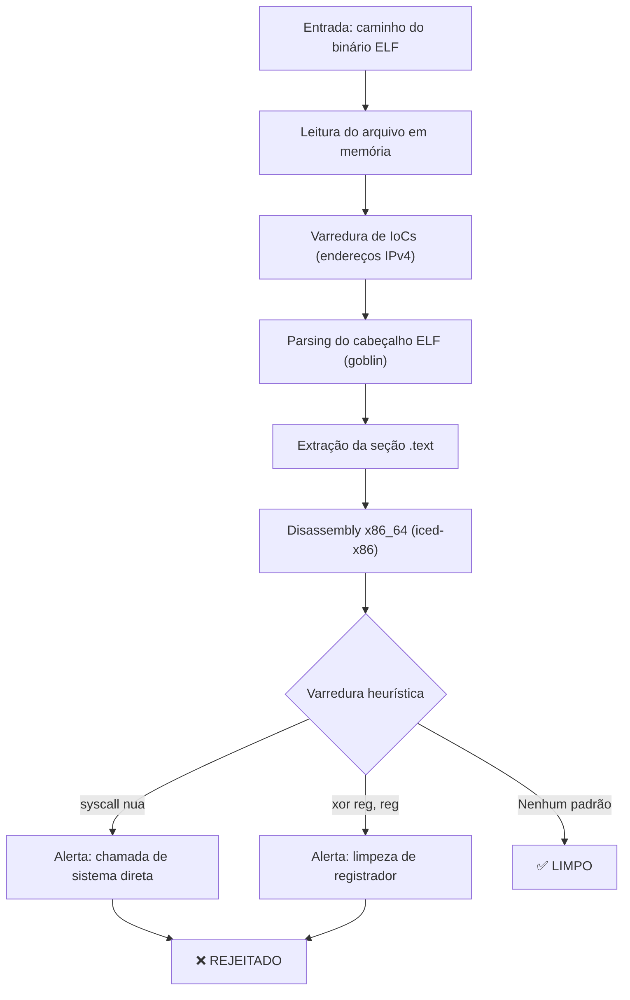

# Obscura

Analisador estático heurístico para binários ELF x86_64. Focado em detecção de padrões de shellcode e técnicas de evasão de EDR via disassembly da seção `.text`. Integra extração estática de Indicadores de Comprometimento (IoC) via análise de memória imutável.

## Arquitetura



## Heurísticas implementadas

| # | Padrão | Descrição | Risco |
|---|--------|-----------|-------|
| 1 | `syscall` nua | Chamada de sistema direta sem intermediação da libc. Comum em shellcode que opera em ring 3 para invocar o kernel diretamente. | Alto |
| 2 | `xor reg, reg` | Limpeza de registrador de 64 bits usando XOR consigo mesmo. Técnica clássica de ofuscação para zerar registradores sem gerar bytes nulos com `mov reg, 0`. | Médio |

## Indicadores de Comprometimento (IoCs)

Varredura estática de endereços IPv4 embutidos na memória imutável do binário. Detecta potenciais pontos de contato C2 ou servidores de distribuição de malware. Filtra automaticamente IPs de loopback (`127.0.0.1`), rota padrão (`0.0.0.0`) e redes privadas (`192.168.0.0/16`).

## Dependências

| Crate | Versão | Função |
|-------|--------|--------|
| `goblin` | 0.9 | Parsing de formatos binários (ELF, PE, Mach-O) |
| `iced-x86` | 1.21 | Disassembler x86/x86_64 de alta performance |
| `regex` | 1.10 | Busca e processamento com expressões regulares |

## Build

```bash
# Build de desenvolvimento (rápido, sem otimizações)
cargo build

# Build de release (LTO + strip — binário otimizado)
cargo build --release
```

O binário compilado estará em `target/release/obscura`.

## Uso

```bash
# Análise de um binário qualquer
./target/release/obscura /usr/bin/ls

# Análise de um binário suspeito
./target/release/obscura ./payload.elf
```

### Exemplo de saída — binário limpo

```
╔═══════════════════════════════════════════════════╗
║          OBSCURA — Análise Heurística ELF        ║
╚═══════════════════════════════════════════════════╝

[ALVO] /usr/bin/echo
─────────────────────────────────────────────────────
[INFO] Seção .text localizada | Endereço base: 0x0000000000001234 | Tamanho: 2048 bytes
─────────────────────────────────────────────────────

  ✅ VEREDITO: LIMPO
  Nenhum padrão suspeito identificado na seção .text.
```

### Exemplo de saída — binário rejeitado

```
╔═══════════════════════════════════════════════════╗
║          OBSCURA — Análise Heurística ELF        ║
╚═══════════════════════════════════════════════════╝

[ALVO] ./payload.elf
─────────────────────────────────────────────────────
[!] IoC Encontrado (Possível C2/Drop IP): 185.220.101.45
─────────────────────────────────────────────────────
[INFO] Seção .text localizada | Endereço base: 0x0000000000401000 | Tamanho: 512 bytes
─────────────────────────────────────────────────────

  ⚠  3 instrução(ões) suspeita(s) identificada(s):

  ┌─ Ocorrência #1
  │ Endereço:  0x0000000000401002
  │ Instrução: xor rax, rax
  │ Motivo:    Limpeza de registrador via XOR — técnica de ofuscação/evasão
  └────────────────────────────────────────────

  ┌─ Ocorrência #2
  │ Endereço:  0x0000000000401010
  │ Instrução: xor rsi, rsi
  │ Motivo:    Limpeza de registrador via XOR — técnica de ofuscação/evasão
  └────────────────────────────────────────────

  ┌─ Ocorrência #3
  │ Endereço:  0x0000000000401020
  │ Instrução: syscall
  │ Motivo:    Chamada de sistema direta (syscall nua) — padrão de shellcode
  └────────────────────────────────────────────

  ❌ VEREDITO: REJEITADO
  O binário apresenta 3 padrão(ões) heurístico(s) associado(s)
  a técnicas de shellcode ou evasão de EDR.
```

## Estrutura do projeto

```
Obscura/
├── Cargo.toml        # Manifesto do projeto e dependências
├── README.md         # Este documento
└── src/
    └── main.rs       # Código-fonte principal
```

## Limitações conhecidas

- Analisa exclusivamente a seção `.text`. Código embutido em `.data`, `.rodata` ou seções customizadas não é inspecionado.
- Heurísticas de detecção são estáticas e baseadas em padrões — não há análise de fluxo de controle ou execução simbólica.
- Suporta apenas binários ELF x86_64. Arquiteturas ARM, MIPS ou formatos PE/Mach-O estão fora do escopo.
- Falsos positivos são esperados em binários legítimos que fazem uso direto de syscalls (ex: runtime do Go, musl-libc).
- Varredura de IoCs pode gerar falsos positivos em binários legítimos que contêm literais de IP em strings de dados.

## Licença

MIT
