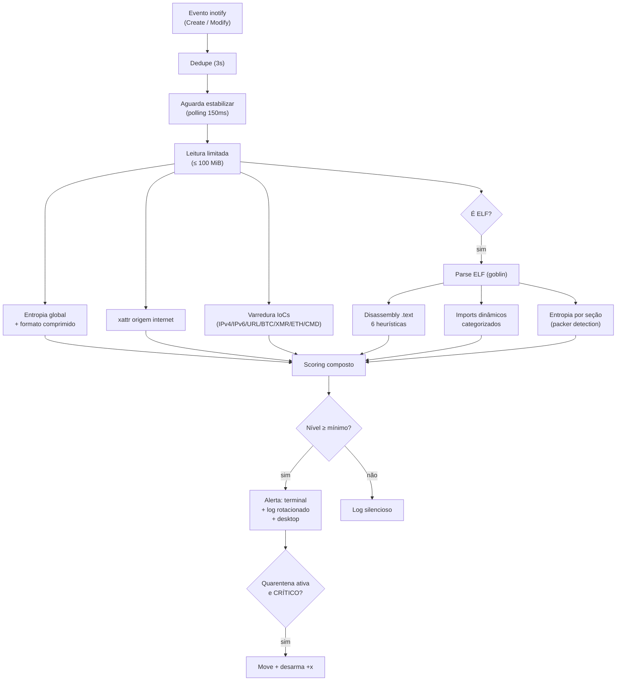

# Obscura

Sentinela de segurança para Linux com dois modos de operação: **daemon em tempo real** via inotify e **analisador estático** de binários ELF x86_64. Combina entropia de Shannon (global e por seção), inspeção de imports dinâmicos, disassembly heurístico, extração de IoCs categorizados (IPv4/IPv6/URL/carteiras crypto/comandos) e verificação de origem de download para emitir alertas no terminal, em arquivo de log rotacionado e via notificação desktop — opcionalmente movendo arquivos críticos para quarentena.

## Funcionalidades

- **Monitoramento em tempo real** de diretórios via inotify (`~/Downloads`, `~/.local/bin` por padrão)
- **Dedupe de eventos** + **espera adaptativa** pela estabilização do arquivo (lida com downloads em andamento)
- **Limite de leitura** (100 MiB) — protege o daemon contra OOM em ISOs/containers gigantes
- **Análise estática de ELF**:
  - disassembly da seção `.text` com 6 heurísticas (syscall, xor, rdtsc, mov rax+syscall, NOP sled, vmcall)
  - inspeção de imports dinâmicos categorizados (anti-debug, resolução dinâmica, spawn, abuso de memória)
  - entropia por seção e detecção de seções não-padrão (packers/crypters)
- **Entropia de Shannon** global + detecção de container comprimido (não penaliza ZIP/APK/GZip)
- **Detecção de origem** via xattrs `user.xdg.origin.url` (Chrome/Firefox)
- **IoCs categorizados**: IPv4, IPv6, URLs, carteiras BTC/XMR/ETH, strings de comando suspeitas
- **Scoring composto** → cinco níveis: LIMPO / BAIXO / MÉDIO / ALTO / CRÍTICO
- **Saída JSON** (`--json`) para integração com SIEM/Loki/ELK
- **Quarentena opcional** (opt-in) — move arquivos críticos para diretório isolado e remove `+x`
- **Log rotacionado** automaticamente a 5 MiB
- **Notificação desktop** via D-Bus/libnotify para alertas MÉDIO e acima
- **Serviço systemd** para o usuário — inicia junto com a sessão gráfica

## Arquitetura

```
obscura
├── analyze   ── leitura → entropia → xattr → IoCs → ELF (text + imports + seções) → veredito
├── analyze --json  ── mesmo fluxo, saída JSON estruturada
└── daemon    ── inotify watch → dedupe → espera estabilizar → analyze → alerta → [quarentena?]
```


```mermaid
flowchart TD
    A["Evento inotify<br/>(Create / Modify)"] --> B["Dedupe (3s)"]
    B --> C["Aguarda estabilizar<br/>(polling 150ms)"]
    C --> D["Leitura limitada<br/>(≤ 100 MiB)"]
    D --> E["Entropia global<br/>+ formato comprimido"]
    D --> F["xattr origem internet"]
    D --> G["Varredura IoCs<br/>(IPv4/IPv6/URL/BTC/XMR/ETH/CMD)"]
    D --> H{"É ELF?"}
    H -->|sim| I["Parse ELF (goblin)"]
    I --> J["Disassembly .text<br/>6 heurísticas"]
    I --> K["Imports dinâmicos<br/>categorizados"]
    I --> L["Entropia por seção<br/>(packer detection)"]
    E & F & G & J & K & L --> M["Scoring composto"]
    M --> N{"Nível ≥ mínimo?"}
    N -->|sim| O["Alerta: terminal<br/>+ log rotacionado<br/>+ desktop"]
    O --> P{"Quarentena ativa<br/>e CRÍTICO?"}
    P -->|sim| Q["Move + desarma +x"]
    N -->|não| R["Log silencioso"]
```

## Instalação

```bash
# Clonar e compilar
git clone https://github.com/Munique-Feitoza/Obscura.git
cd Obscura
cargo build --release

# Instalar o binário
cp target/release/obscura ~/.local/bin/

# Gerar configuração padrão
obscura init-config

# Instalar e ativar o serviço systemd
obscura install
systemctl --user daemon-reload
systemctl --user enable --now obscura
```

## Uso

```bash
obscura analyze <arquivo>          # análise estática pontual (saída humana)
obscura analyze <arquivo> --json   # análise com saída JSON estruturada
obscura daemon                     # sentinel em tempo real (bloqueante)
obscura daemon --config <path>     # daemon com config customizada
obscura install                    # instala o .service no systemd --user
obscura init-config                # gera ~/.config/obscura/config.json
```

### Saída — binário limpo

```
  Alvo      : /bin/ls
  Tamanho   : 142.95 KiB
  Veredito  : LIMPO
  Pontuação : 0.0 pts
  Entropia  : 6.0308 bits/byte
  ELF       : sim
  +exec     : sim
  Internet  : não
```

### Saída — ameaça detectada

```
  Alvo      : /home/user/Downloads/payload
  Tamanho   : 2.34 MiB
  Veredito  : CRITICO
  Pontuação : 11.5 pts
  Entropia  : 7.8234 bits/byte [MUITO ALTA — possível packer/crypt]
  ELF       : sim
  +exec     : sim ⚠
  Internet  : sim ⚠

  IoCs detectados (4):
    [IPv4] 185.220.101.45
    [URL] http://evil.example.com/c2
    [BTC] 1A1zP1eP5QGefi2DMPTfTL5SLmv7DivfNa
    [CMD] /dev/tcp/

  Seções ELF não-padrão com entropia alta (1):
    → .upx (7.985 bits, 1048576 bytes)

  Imports suspeitos (3):
    → ptrace [anti-debug]
    → dlsym [resolução dinâmica]
    → execve [spawn de processo]

  Padrões ELF (2 instrução(ões) suspeita(s)):
  ┌─ [0x0000000000400520] syscall
  └─ Syscall direta ao kernel (execve) — bypass libc / shellcode
  ┌─ [0x0000000000400540] nop × 32 bytes
  └─ Sled de NOP single-byte — padrão clássico de cushion para shellcode
```

### Saída JSON (`--json`)

```json
{
  "caminho": "/home/user/Downloads/payload",
  "timestamp": "2026-05-19T13:42:11.123-03:00",
  "entropia": 7.8234,
  "tem_permissao_exec": true,
  "veio_da_internet": true,
  "iocs": [
    { "tipo": "ipv4", "valor": "185.220.101.45" },
    { "tipo": "url", "valor": "http://evil.example.com/c2" }
  ],
  "instrucoes_suspeitas": [ ... ],
  "imports_suspeitos": [ ... ],
  "secoes_anomalas": [ ... ],
  "eh_elf": true,
  "nivel_ameaca": "critico",
  "pontuacao": 11.5,
  "formato_comprimido": false,
  "tamanho_arquivo": 2456789,
  "arquivo_truncado": false
}
```

## Configuração

Arquivo JSON em `~/.config/obscura/config.json` gerado com `obscura init-config`:

```json
{
  "diretorios_monitorados": [
    "/home/user/Downloads",
    "/home/user/.local/bin"
  ],
  "caminhos_ignorados": ["/tmp/node-compile-cache"],
  "limiar_entropia": 7.0,
  "caminho_log": "/home/user/.local/share/obscura/obscura.log",
  "notificacoes_desktop": true,
  "extensoes_ignoradas": [".jpg", ".png", ".mp4", ".pdf", ".txt"],
  "nivel_minimo_alerta": 2,
  "quarentena": {
    "ativa": false,
    "nivel_minimo": 4,
    "diretorio": "/home/user/.local/share/obscura/quarentena",
    "remover_executavel": true
  }
}
```

| Campo | Descrição |
|---|---|
| `diretorios_monitorados` | Diretórios observados pelo daemon via inotify |
| `caminhos_ignorados` | Prefixos de caminho a descartar (cache, sockets temporários) |
| `limiar_entropia` | Entropia mínima (bits/byte) para pontuar suspeição. Padrão: `7.0` |
| `nivel_minimo_alerta` | `0` = todos, `1` = BAIXO+, `2` = MÉDIO+ (padrão), `3` = ALTO+ |
| `extensoes_ignoradas` | Arquivos com essas extensões são ignorados pelo daemon |
| `quarentena.ativa` | Liga a quarentena automática (padrão `false` — somente alerta) |
| `quarentena.nivel_minimo` | Nível mínimo para acionar (4 = CRITICO por padrão) |
| `quarentena.diretorio` | Onde os arquivos quarentenados são movidos |
| `quarentena.remover_executavel` | Remove `+x` antes de mover (defesa em profundidade) |

## Scoring de ameaça

| Condição | Pontos |
|---|---|
| Entropia > 7.5 (binário raw) | +3.0 |
| Entropia > 7.0 (binário raw) | +2.0 |
| Entropia > 6.5 (binário raw) | +1.0 |
| Container comprimido (ZIP/APK/GZip…) | entropia não pontua |
| IoC IPv4/IPv6 público | +2.0 |
| IoC URL HTTP/HTTPS | +1.5 |
| IoC carteira BTC/XMR/ETH | +4.0 |
| IoC string de comando suspeita | +2.5 |
| Import `ptrace`/`prctl` (anti-debug) | +1.5 |
| Import `dlsym`/`dlopen` (resolução dinâmica) | +1.0 |
| Import `mprotect` (abuso de memória) | +0.5 |
| Import `execve`/`system`/`popen` | +0.3 |
| Seção ELF não-padrão com entropia > 7.0 | +1.5 |
| Sled de NOPs single-byte (≥ 16 bytes) | +2.0 |
| Instrução `vmcall`/`vmlaunch` em user-space | +2.0 |
| Syscall direta identificada como `execve`/`ptrace` | +2.5 |
| Syscall direta genérica | +1.0 |
| Instrução `rdtsc` (timing/anti-debug) | +0.5 |
| Padrão `xor reg, reg` | +0.5 |
| Executável + origem confirmada na internet | +4.0 |
| Apenas origem internet | +1.5 |
| Apenas permissão +x | +0.5 |

Limiares: 0 = LIMPO · 1–2 = BAIXO · 3–4 = MÉDIO · 5–7 = ALTO · 8+ = CRÍTICO

## Heurísticas ELF (disassembly)

| # | Padrão | Motivo |
|---|--------|--------|
| 1 | `syscall` | Invocação direta do kernel sem libc — shellcode |
| 2 | `mov rax, imm` + `syscall` | Identifica a syscall (execve, ptrace, mprotect…) — sinal forte |
| 3 | `xor reg, reg` | Zeragem de registrador 64-bit — ofuscação/evasão |
| 4 | `rdtsc` / `rdtscp` | Leitura de timestamp counter — timing checks / anti-debug |
| 5 | Sled de `nop` single-byte (≥ 16) | Cushion clássico de exploit |
| 6 | `vmcall` / `vmlaunch` / `vmread` | Instruções VMX em user-space — anti-VM / escape |

## Inspeção de imports dinâmicos

| Categoria | Símbolos detectados | Peso |
|---|---|---|
| Anti-debug | `ptrace`, `prctl`, `process_vm_readv/writev` | 1.5 |
| Resolução dinâmica | `dlsym`, `dlopen`, `dlmopen` | 1.0 |
| Abuso de memória | `mprotect`, `pkey_mprotect`, `memfd_create` | 0.5 |
| Spawn de processo | `execve`, `execvp`, `system`, `popen`, `posix_spawn` | 0.3 |

## Filtro de IoCs

- **IPv4**: descarta privados (RFC1918), reservados, OIDs ASN.1 (1.3.6.*, 2.5.*), e strings de versão (`pkg-1.24.0.38-linux`)
- **IPv6**: descarta loopback, link-local (`fe80::/10`), ULA (`fc00::/7`), multicast e ruído em identificadores
- **URLs**: descarta namespaces XML (W3C, Microsoft, OASIS, Android) e localhost
- **Carteiras crypto**: descarta endereços Ethereum com baixa entropia hex (constantes/zero address)
- **Comandos**: substring match em padrões diagnósticos (`/dev/tcp/`, `bash -i`, `nc -e`, `curl|sh`, `chmod +x`, …)

## Detecção de formato comprimido

Formatos identificados por magic bytes — a entropia alta nesses casos é esperada e **não pontua**:

`ZIP / APK / JAR` · `GZip` · `Bzip2` · `XZ` · `7-Zip` · `RAR` · `Zstandard` · `LZ4`

## Dependências

| Crate | Versão | Função |
|---|---|---|
| `goblin` | 0.9 | Parsing de ELF (seções, símbolos dinâmicos) |
| `iced-x86` | 1.21 | Disassembler x86/x86_64 |
| `regex` | 1.10 | Extração de IoCs (str + bytes) |
| `notify` | 6 | Monitoramento de sistema de arquivos via inotify |
| `notify-rust` | 4 | Notificações desktop via D-Bus/libnotify |
| `clap` | 4 | Interface de linha de comando com subcomandos |
| `xattr` | 1 | Leitura de atributos estendidos (origem de download) |
| `chrono` | 0.4 | Timestamps nos logs (com serde) |
| `serde` + `serde_json` | 1 | Serialização da configuração e modo `--json` |

## Monitorar o daemon

```bash
# Status do serviço
systemctl --user status obscura

# Log em tempo real (saída do daemon)
journalctl --user -u obscura -f

# Arquivo de alertas (rotacionado automaticamente a 5 MiB)
tail -f ~/.local/share/obscura/obscura.log

# Pipeline para SIEM (Loki/Splunk):
obscura analyze /tmp/sample.elf --json | jq '.nivel_ameaca, .iocs'
```

## Estrutura do projeto

```
obscura/
├── Cargo.toml
├── obscura.service       # template do serviço systemd
├── src/
│   ├── main.rs           # CLI (clap) e subcomandos
│   ├── analysis.rs       # motor: entropia, IoCs, ELF, imports, seções, scoring (+ 43 testes)
│   ├── daemon.rs         # watcher inotify, dedupe, espera adaptativa, quarentena
│   ├── alert.rs          # terminal colorido, log rotacionado, notificação desktop
│   └── config.rs         # configuração JSON
└── test_binary.elf       # binário sintético para testes
```

## Testes

```bash
cargo test      # 43 testes unitários cobrindo funções puras e heurísticas
```

Cobertura: entropia (vazia, uniforme, pseudoaleatória), detecção de formato comprimido (todos os magics), classificação de IPs privados/OIDs, varredura de IoCs (IPv4/IPv6/URL/BTC/ETH/comandos com filtros de contexto), heurísticas ELF (syscall isolada, execve/ptrace identificados, xor, rdtsc, NOP sled, vmcall), classificador de imports, reconhecimento de seções padrão, e scoring composto.

## Limitações conhecidas

- Análise ELF de instruções restrita à seção `.text` — código em outras seções é apenas pesado por entropia
- Heurísticas estáticas sem análise de fluxo de controle ou execução simbólica
- Suporte apenas a ELF x86_64 — ARM, MIPS, PE e Mach-O estão fora do escopo
- Arquivos acima de 100 MiB são analisados apenas no prefixo (flag `arquivo_truncado` no JSON)
- Notificações desktop exigem D-Bus ativo (sessão gráfica); não funcionam em TTY puro
- A origem via xattr depende do navegador/gerenciador de downloads ter gravado o atributo — `curl`/`wget` não definem o xattr
- Log mantém apenas uma cópia rotacionada (`obscura.log.1`); para retenção maior, use logrotate externo
- Quarentena é uma ação destrutiva (rename) — recomendada apenas com `nivel_minimo: 4` (CRITICO)

## Licença

GPL v2 — veja [LICENSE](LICENSE) para o texto completo.
