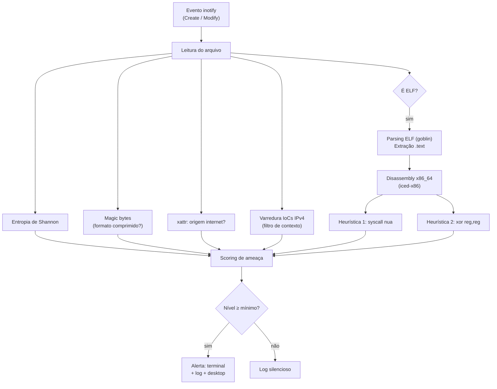

# Obscura

Sentinela de segurança para Linux com dois modos de operação: **daemon em tempo real** via inotify e **analisador estático** de binários ELF x86_64. Combina cálculo de entropia de Shannon, verificação de origem de download, extração de IoCs e disassembly heurístico para emitir alertas no terminal, em arquivo de log e via notificação desktop.

## Funcionalidades

- **Monitoramento em tempo real** de diretórios via inotify (`~/Downloads`, `/tmp`, `~/.local/bin` por padrão)
- **Análise estática de ELF**: disassembly da seção `.text` com detecção de syscalls diretas e padrões de evasão
- **Entropia de Shannon**: identifica binários empacotados, cifrados ou comprimidos suspeitos
- **Detecção de origem**: lê xattrs (`user.xdg.origin.url`) definidos por Chrome/Firefox para saber se o arquivo veio da internet
- **Extração de IoCs**: regex de IPv4 com filtro de contexto (elimina strings de versão e IPs privados)
- **Scoring de ameaça**: pontuação composta que resulta em cinco níveis — LIMPO / BAIXO / MÉDIO / ALTO / CRÍTICO
- **Notificação desktop** via D-Bus/libnotify para alertas MÉDIO e acima
- **Log estruturado** compatível com `tail -f`
- **Serviço systemd** para o usuário — inicia junto com a sessão gráfica

## Arquitetura

```
obscura
├── analyze  ── lê arquivo → entropia → xattr → IoCs → ELF+disassembly → veredito
└── daemon   ── inotify watch → evento Create/Modify → analyze → scoring → alerta
```


```mermaid
flowchart TD
    A["Evento inotify\n(Create / Modify)"] --> B["Leitura do arquivo"]
    B --> C["Entropia de Shannon"]
    B --> D["Magic bytes\n(formato comprimido?)"]
    B --> E["xattr: origem internet?"]
    B --> F["Varredura IoCs IPv4\n(filtro de contexto)"]
    B --> G{"É ELF?"}
    G -->|sim| H["Parsing ELF (goblin)\nExtração .text"]
    H --> I["Disassembly x86_64\n(iced-x86)"]
    I --> J["Heurística 1: syscall nua"]
    I --> K["Heurística 2: xor reg,reg"]
    C & D & E & F & J & K --> L["Scoring de ameaça"]
    L --> M{"Nível ≥ mínimo?"}
    M -->|sim| N["Alerta: terminal\n+ log + desktop"]
    M -->|não| O["Log silencioso"]
```

## Instalação

```bash
# Clonar e compilar
git clone git@github.com:Munique-Feitoza/Obscura.git
cd obscura
cargo build --release

# Instalar o binário
cp target/release/obscura ~/.local/bin/

# Gerar configuração padrão
obscura init-config

# Instalar e ativar o serviço systemd
obscura install
systemctl --user daemon-reload
systemctl --user enable --now obscura
```

## Uso

```bash
obscura analyze <arquivo>      # análise estática pontual
obscura daemon                 # sentinel em tempo real (bloqueante)
obscura daemon --config <path> # daemon com config customizada
obscura install                # instala o .service no systemd --user
obscura init-config            # gera ~/.config/obscura/config.json
```

### Saída — binário limpo

```
  Veredito  : LIMPO
  Pontuação : 0.0 pts
  Entropia  : 6.0308 bits/byte
  ELF       : sim
  +exec     : não
  Internet  : não
```

### Saída — ameaça detectada

```
  Veredito  : MEDIO
  Pontuação : 4.5 pts
  Entropia  : 4.3180 bits/byte
  ELF       : sim
  +exec     : sim ⚠
  Internet  : não

  IoCs detectados (2):
    → 185.220.101.45
    → 93.184.216.34
```

## Configuração

Arquivo JSON em `~/.config/obscura/config.json` gerado com `obscura init-config`:

```json
{
  "diretorios_monitorados": [
    "/home/user/Downloads",
    "/tmp",
    "/home/user/.local/bin"
  ],
  "limiar_entropia": 7.0,
  "caminho_log": "/home/user/.local/share/obscura/obscura.log",
  "notificacoes_desktop": true,
  "extensoes_ignoradas": [".jpg", ".png", ".mp4", ".mp3", ".pdf", ".txt"],
  "nivel_minimo_alerta": 2
}
```

| Campo | Descrição |
|---|---|
| `diretorios_monitorados` | Diretórios observados pelo daemon via inotify |
| `limiar_entropia` | Entropia mínima (bits/byte) para pontuar suspeição. Padrão: `7.0` |
| `nivel_minimo_alerta` | `0` = todos, `1` = BAIXO+, `2` = MÉDIO+ (padrão), `3` = ALTO+ |
| `extensoes_ignoradas` | Arquivos com essas extensões são ignorados pelo daemon |

## Scoring de ameaça

| Condição | Pontos |
|---|---|
| Entropia > 7.5 (binário raw) | +3.0 |
| Entropia > 7.0 (binário raw) | +2.0 |
| Entropia > 6.5 (binário raw) | +1.0 |
| Container comprimido (ZIP/APK/GZip…) | entropia não pontua |
| Cada IoC externo detectado | +2.0 |
| Instrução `syscall` nua na `.text` | +1.0 |
| Padrão `xor reg, reg` na `.text` | +0.5 |
| Executável + origem confirmada na internet | +4.0 |
| Apenas origem internet | +1.5 |
| Apenas permissão +x | +0.5 |

Limiares: 0 = LIMPO · 1–2 = BAIXO · 3–4 = MÉDIO · 5–7 = ALTO · 8+ = CRÍTICO

## Heurísticas ELF

| # | Padrão | Motivo |
|---|--------|--------|
| 1 | `syscall` nua | Invocação direta do kernel sem libc — padrão de shellcode |
| 2 | `xor reg, reg` | Zeragem de registrador de 64 bits — técnica de ofuscação/evasão de EDR |

## Filtro de IoCs

O scanner de IPv4 aplica dois níveis de filtragem para reduzir falsos positivos:

1. **IPs privados e reservados**: `127.0.0.1`, `0.0.0.0`, RFC1918 (`10.x`, `172.16–31.x`, `192.168.x`), link-local, multicast
2. **Filtro de contexto**: descarta o match se o byte anterior for `[-@a-zA-Z_]` (string de versão como `pkg-1.2.3.4`) ou se o byte posterior for um dígito (octeto > 255, como `1.24.0.388`)

## Detecção de formato comprimido

Formatos identificados por magic bytes — a entropia alta nesses casos é esperada e **não pontua**:

`ZIP / APK / JAR` · `GZip` · `Bzip2` · `XZ` · `7-Zip` · `RAR` · `Zstandard` · `LZ4`

## Dependências

| Crate | Versão | Função |
|---|---|---|
| `goblin` | 0.9 | Parsing de ELF, PE e Mach-O |
| `iced-x86` | 1.21 | Disassembler x86/x86_64 |
| `regex` | 1.10 | Extração de IoCs com expressões regulares |
| `notify` | 6 | Monitoramento de sistema de arquivos via inotify |
| `notify-rust` | 4 | Notificações desktop via D-Bus/libnotify |
| `clap` | 4 | Interface de linha de comando com subcomandos |
| `xattr` | 1 | Leitura de atributos estendidos (origem de download) |
| `chrono` | 0.4 | Timestamps nos logs |
| `serde` + `serde_json` | 1 | Serialização da configuração |

## Monitorar o daemon

```bash
# Status do serviço
systemctl --user status obscura

# Log em tempo real (saída do daemon)
journalctl --user -u obscura -f

# Arquivo de alertas
tail -f ~/.local/share/obscura/obscura.log
```

## Estrutura do projeto

```
obscura/
├── Cargo.toml
├── obscura.service       # template do serviço systemd
├── src/
│   ├── main.rs           # CLI (clap) e subcomandos
│   ├── analysis.rs       # motor de análise: entropia, IoCs, ELF, scoring
│   ├── daemon.rs         # watcher inotify e processamento de eventos
│   ├── alert.rs          # terminal colorido, log e notificação desktop
│   └── config.rs         # configuração JSON
└── test_binary.elf       # binário sintético para testes
```

## Limitações conhecidas

- Análise ELF restrita à seção `.text` — código em `.data`, `.rodata` ou seções customizadas não é inspecionado
- Heurísticas estáticas sem análise de fluxo de controle ou execução simbólica
- Suporte apenas a ELF x86_64 — ARM, MIPS, PE e Mach-O estão fora do escopo
- Notificações desktop exigem D-Bus ativo (sessão gráfica); não funcionam em TTY puro
- A origem via xattr depende do navegador/gerenciador de downloads ter gravado o atributo — downloads via `curl` ou `wget` não terão o xattr definido
